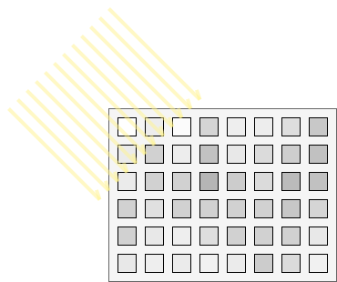
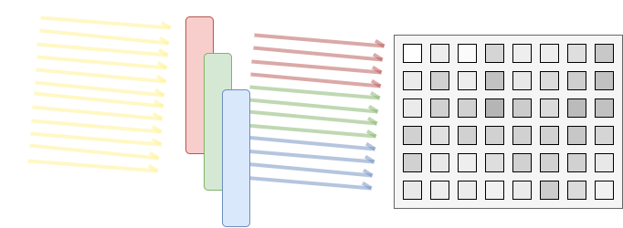
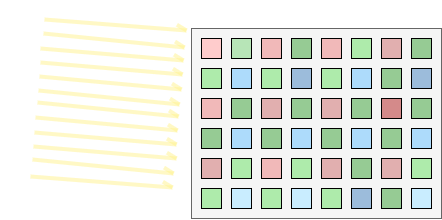

@page how_to_debayer How to debayer images
@brief Convert images from raw Bayer formats to RGB

Debayering an essential task of any image processing system, due to how image sensors are able to
perceive colors.

## When use raw bayer data?

Most image sensors targetting embedded systems are able to do debayer on their own and the image
arrives immediately in RGB565 or YUYV format, so no need to perform debayer in such case.

However, sensors performing debayer directly produce more heat and digital noise so the image
quality can be better for sensors that produce

Furthermore, raw bayer data (often 8 bit/pixel) is typically smaller than decoded data
(often 16 bit/pixel).

Some image sensors can also sense infra-red and many other wavelength such as the case of
[hyperspectral](https://en.wikipedia.org/wiki/Hyperspectral_imaging) image sensors.

Adding support in software is easier than hardware as every stage is reconfigurable without
requiring new chips, and RGB-IR support can easily be
[added to libmpix on request](https://github.com/libmpix/libmpix/issues/new).

## Explanation of debayer

A black and white image sensor does not make any distinction between the wavelength (color) of
light and every cell receives the full spectrum information: no distinction between colors.



In order to sense each particular color, filters need to be added so that some image cells can
be sensitive to just one color information such as the red, green or blue wavelength



But the filter has to be aligned with every pixel so that it is possible to give each pixel an
unique color. And with a well-known pattern to assign each pixel is to a known color R, G or B.
The most widespread pattern is the Bayer pattern:



Once the data arrives to the MCU, it is not in RGB format but in grayscale, and by knowing the
position of the bayer filter, it is possible to reconstitute the RGB data. This process is called
**debayer**.


## How to do debayer on libmpix

The name of the bayer format is obtained by looking at the order of colors in a bayer image:


Then the image is imported from a buffer or another source using this format.

```c
struct mpix_image img;

mpix_image_from_buf(&img, buf, sizeof(buf), 640, 480, MPIX_FMT_SBGGR8);
```

There are multiple strategies to implement the debayer operation:

- Debayer 3x3 combines pixels from a bayer grid of 3 by 3 pixels to produce 1 RGB pixel, for a
  higher quality result than 2x2, but at a slight higher performance overhead.

- Debayer 2x2 combines pixels from a bayer grid of 2 by 2 pixels to produce 1 RGB pixel, which is
  the minimum required to recover color information from bayer.

- Debayer 1x1 is generating 1 RGB pixel for 1 bayer pixel, which is only useful to inspect the
  raw bayer data, useful for debugging.

Knowing this, it is now possible to choose a debayer operation, such as 2x2:

```c
mpix_image_debayer(&img, 2);
```

The data will then be in @ref MPIX_FMT_RGB24 format and processing can continue in RGB.
