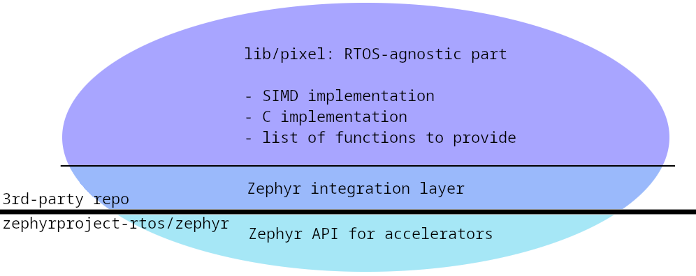

@page zephyr_integration Zephyr integration
@brief Zephyr version supported, Zephyr-specific APIs

## Version support

While libmpix is a portable library, it supports the Zephyr RTOS out of the box and integrates
with its build system for the following versions:

- [Zephyr `v3.6`](https://github.com/libmpix/libmpix/tree/main/ports/zephyr_3_6)
- [Zephyr `main`](https://github.com/libmpix/libmpix/tree/main/ports/zephyr_main)
- [Ask for more!](https://github.com/libmpix/libmpix/issues/new)

## Zephyr-specific APIs

To reduce boilerplate, the libmpix allows extra wrappers to conveniently process image data
coming from the video drivers using `struct video_buffer`:

```c
/* Output format for the video device  */
struct video_format fmt;

/* Video buffer fed with data from the video device */
struct video_buffer *vbuf;

/* libmpix image */
struct mpix_image img;

/* Query the output format and request a video buffer */
[...]

/* Store the video buffer into a libmpix image */
mpix_image_from_vbuf(&img, vbuf, &fmt);

/* Add libmpix image processing here */
[...]

/* Store the processed image back into the (large enough) video buffer */
mpix_image_to_vbuf(&img, vbuf);
```

For a complete end-to-end example, see the
[`libmpix_example_zephyr`](https://github.com/libmpix/libmpix_example_zephyr) repository.

## Implementation details

Just like any other ecosystem, Zephyr uses a
[port](https://github.com/libmpix/libmpix/tree/main/ports) acting as integration layer:


